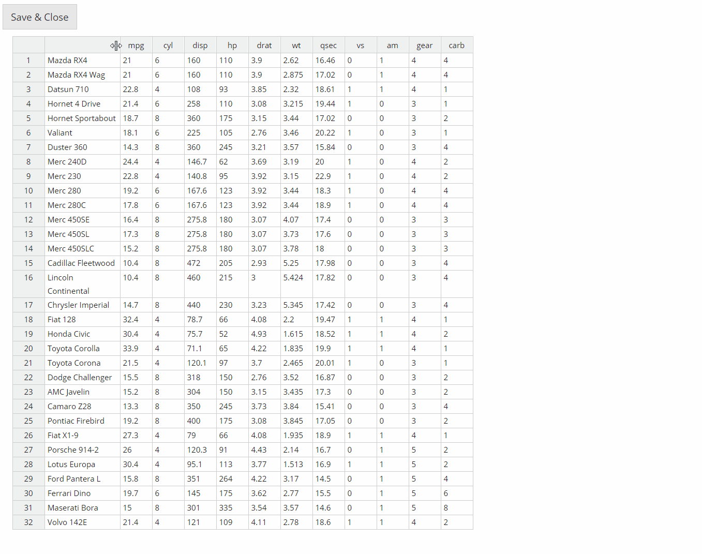

<!-- README.md is generated from README.Rmd. Please edit that file -->

```{r, include = FALSE}
knitr::opts_chunk$set(
  collapse = TRUE,
  comment = "#>",
  fig.path = "man/figures/",
  out.width = "100%"
)
```

# DataEditR 

<!-- badges: start -->
[](https://www.repostatus.org/#active)
[](https://travis-ci.com/DillonHammill/dataeditR)
[](https://ci.appveyor.com/project/DillonHammill/dataeditR)
<!-- badges: end -->

Manual data entry and editing in R can be tedious, especially if you have limited coding experience and are accustomed to using software with a Graphical User Interface (GUI). **DataEditR** is an R package that makes it easy to enter and edit data within R, due to its convenient interactive GUI that supports many of the data manipulation operations supported by other commonly used GUI-oriented software.

## Installation

**DataEditR** can be installed directly from GitHub:
```{r, eval = FALSE}
library(devtools)
install_github("DillonHammill/DataEditR")
```

## Usage

**DataEditR** ships with a single function called `data_edit()` that allows you to interactively enter or edit data in R. The key features of the data editor are summarised below and will be explored in detail in the package vignette:

- a quick way to view your data
- create data.frames from scratch 
- load tabular data saved to file using any reading function (e.g. `read.csv()`)
- row indices are always included even if row names have been specified
- addition/removal of rows or columns
- editing of either row or column names
- manual column resizing
- drag a cell to fill others
- paste data from other software directly into the editor
- programmatically add columns/rows prior to loading the data editor
- copy and paste edited data into other software
- edited data can be optionally saved to file using any writing function (e.g. `write.csv()`)
- edited data is exported as a matrix or data.frame for use within R
- data editor is opened in the RStudio Viewer pane by default but can be changed to open in a pop-up window or web browser
- developers can add checkbox or dropdown columns for user input
- developers can customize the data editor with their own package logo and title

A quick demonstration of some of these features can be seen below, where we use `data_edit()` to make changes to the `mtcars` dataset and save the result to a new csv file:

```{r, eval = FALSE}
# Load required packages
library(DataEditR)

# Save output to R object & csv file
mtcars_new <- data_edit(mtcars,
                        save_as = "mtcars_new.csv")
```

```{r, echo=FALSE, fig.align="center", out.width = '100%'}

```

## Credits

**DataEditR** is built using the fantastic [rhandsontable](https://github.com/jrowen/rhandsontable) package. **DataEditR** makes use of many features for entering and editing data, but **rhandsontable** has support for much more sophisticated interactive representations of data should you need them.

## Code of Conduct
  
Please note that the **DataEditR** project is released with a [Contributor Code of Conduct](https://contributor-covenant.org/version/2/0/CODE_OF_CONDUCT.html). By contributing to this project, you agree to abide by its terms.

## Citation

If you use **DataEditR** in your work, please cite the package as follows:
```{r}
citation("DataEditR")
```
