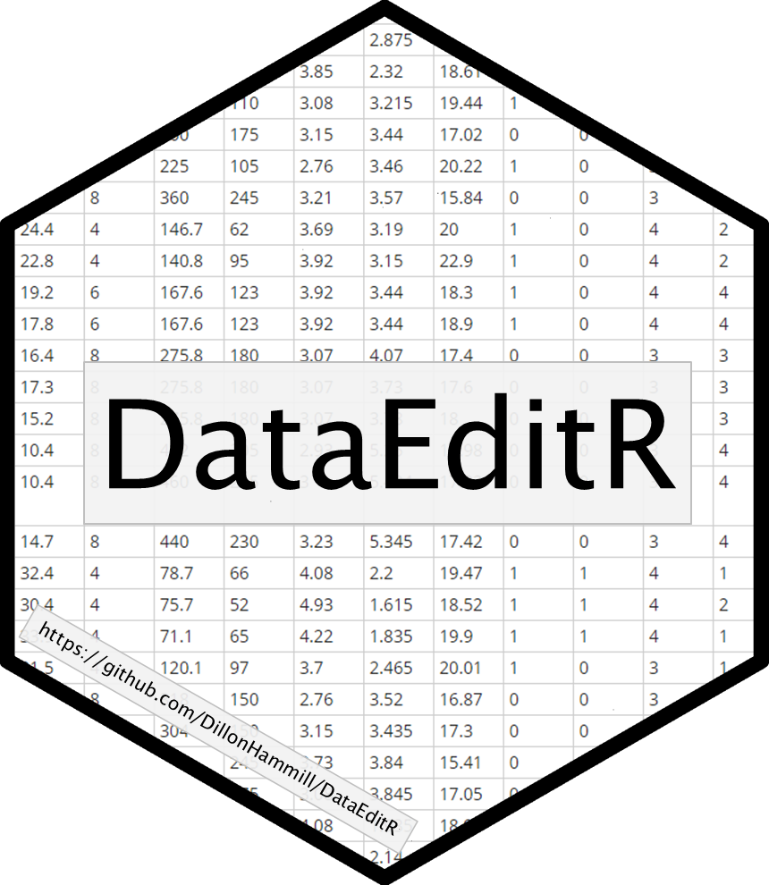

<!-- README.md is generated from README.Rmd. Please edit that file -->

# DataEditR 

<!-- badges: start -->

[](https://www.repostatus.org/#active)
[](https://lifecycle.r-lib.org/articles/stages.html)
[](https://github.com/DillonHammill/DataEditR/actions?workflow=R-CMD-check)
[](https://CRAN.R-project.org/package=DataEditR)
[](https://cran.r-project.org/package=DataEditR)
<!-- badges: end -->

Manual data entry and editing in R can be tedious, especially if you
have limited coding experience and are accustomed to using software with
a Graphical User Interface (GUI). **DataEditR** is an R package built on
shiny and rhandsontable that makes it easy to interactively view, enter,
filter and edit data. If you are new to **DataEditR** visit
<https://dillonhammill.github.io/DataEditR/> to get started.

## Installation

**DataEditR** can be installed from CRAN:

``` r
install.packages("DataEditR")
```

The development version of **DataEditR** can be installed directly from
GitHub:

``` r
library(devtools)
install_github("DillonHammill/DataEditR")
```

To ensure that `DataEditR` works as expected, you will also need to
install my fork of `rhandsontable`:

``` r
devtools::install_github("DillonHammill/rhandsontable")
```

## Usage

**DataEditR** ships with a series of shiny modules, namely `dataInput`,
`dataSelect`, `dataFilter`, `dataEdit` and `dataOutput` which have been
wrapped up into a single function called `data_edit()` to create an
interactive data editor. You can use `data_edit()` as a standalone
application, or include the relevant modules within your own shiny
applications. Alternatively, `DataEditR` also ships with an RStudio
add-in should you prefer to interact with it in this way.

#### General features:

-   RStudio add-in
-   flexible display options (either `dialog` box, `browser` or RStudio
    `viewer` pane)
-   fast rendering to quickly view datasets
-   ability to interactively create data.frames from scratch
-   load tabular data saved to file using any reading function
    (e.g. `read.csv()`)
-   save edited data to file using any writing function
    (e.g. `write.csv()`)
-   return appropriately formatted data as an R object for downstream
    use
-   code required to create edited data can be optionally printed to the
    console or saved to a file
-   support for custom themes through `shinythemes` package
-   customisable user interface (title, logo and modules)
-   row indices are always displayed for easy navigation
-   switch between datasets or files without having to leave the
    application

#### Data editing features:

-   column selection using the `dataSelect` module
-   row selection using the `dataFilter` module
-   edit row or column names
-   addition or removal of rows or columns
-   manual column resizing
-   drag to fill cells
-   copy or paste data to and from external software
-   custom column types to simplify user input (e.g. checkboxes and
    dropdown menus)
-   support for readonly columns to prevent users from editing certain
    columns
-   control over which column names can be edited
-   stretch columns horizontally to fill available space
-   programmatically add columns or rows to data prior to loading into
    the data editor

A quick demonstration of some of these features can be seen below, where
we use `data_edit()` to make changes to the `mtcars` dataset and save
the result to a new csv file:

``` r
# Load required packages
library(DataEditR)

# Save output to R object & csv file
mtcars_new <- data_edit(mtcars,
                        save_as = "mtcars_new.csv")
```


## Credits

**DataEditR** is built using the fantastic
[rhandsontable](https://github.com/jrowen/rhandsontable) package.
**DataEditR** makes use of many features for entering and editing data,
but **rhandsontable** has support for much more sophisticated
interactive representations of data should you need them. The user
interface of **DataEditR** has been inspired by the
[editData](https://github.com/cardiomoon/editData) package which is a
great alternative to **DataEditR**.

## Code of Conduct

Please note that the **DataEditR** project is released with a
[Contributor Code of
Conduct](https://contributor-covenant.org/version/2/0/CODE_OF_CONDUCT.html).
By contributing to this project, you agree to abide by its terms.

## Citation

If you use **DataEditR** in your work, please cite the package as
follows:

``` r
citation("DataEditR")
#> 
#> To cite package 'DataEditR' in publications use:
#> 
#>   Dillon Hammill (2021). DataEditR: An Interactive Editor for Viewing,
#>   Entering, Filtering & Editing Data. R package version 0.1.3.
#>   https://github.com/DillonHammill/DataEditR
#> 
#> A BibTeX entry for LaTeX users is
#> 
#>   @Manual{,
#>     title = {DataEditR: An Interactive Editor for Viewing, Entering, Filtering & Editing Data},
#>     author = {Dillon Hammill},
#>     year = {2021},
#>     note = {R package version 0.1.3},
#>     url = {https://github.com/DillonHammill/DataEditR},
#>   }
```
