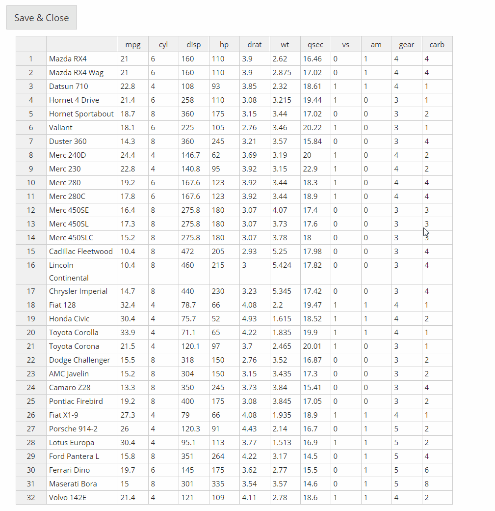
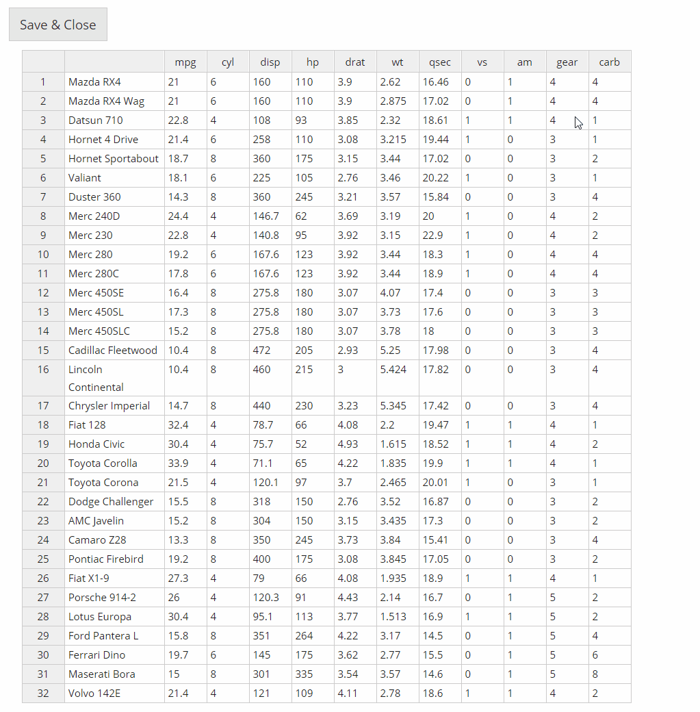
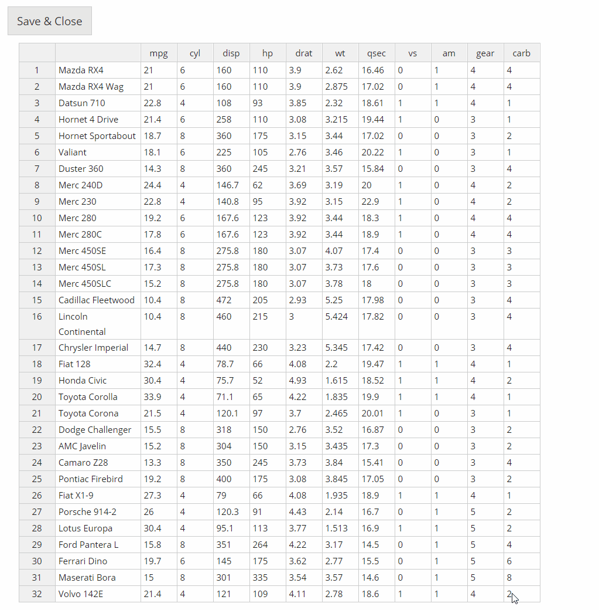
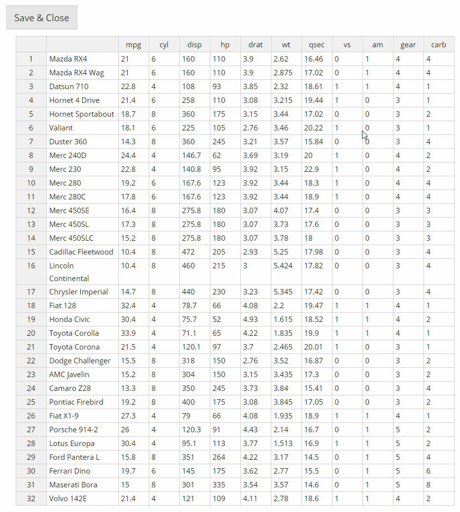
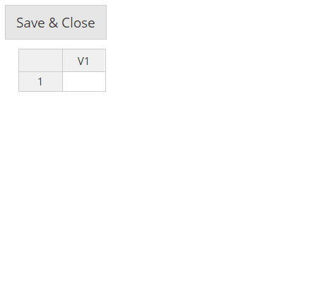
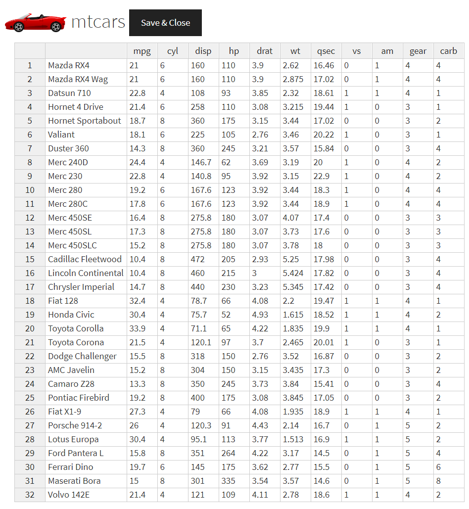

```{r, include = FALSE}
knitr::opts_chunk$set(
  collapse = TRUE,
  comment = "#>"
)
```

```{r, echo = FALSE, eval = FALSE}
# To create html logo to include in header
img <- htmltools::img(src = knitr::image_uri("logo.png"), 
                      alt = 'logo', 
                      style = 'float:right; width:150px')
html <- htmltools::doRenderTags(img)
readr::write_lines(html, path = "logo.html")
```

**DataEditR** is a lightweight package to interactively view, enter or edit data in R. In this vignette we will explore some of the key features that are available through the `data_edit()` function. 

```{r setup}
library(DataEditR)
```

## 1. Add/remove columns or rows

Right click on a cell within the table to reveal the options to add or remove rows or columns. You can turn off row or column editing by setting the `row_edit` and/or `col_edit` arguments to FALSE.

```{r, eval = FALSE}
data_edit(mtcars)
```

```{r echo = FALSE, fig.align="center", out.width = '100%'}

```

## 2. Rename columns or rows

Click on the name of the row or column to rename it. The row names will appear inside the table so that the row indices can always be displayed on the left hand side. Currently, there is no way to turn off the ability to edit row or column names.

```{r, eval = FALSE}
data_edit(mtcars)
```

```{r echo = FALSE, fig.align="center", out.width = '100%'}

```

## 3. Resize columns

Columns can be manually resized by hovering over the right hand side of the column name and dragging to the desired width.

```{r, eval = FALSE}
data_edit(mtcars)
```

```{r echo = FALSE, fig.align="center", out.width = '100%'}

```

## 4. Drag to fill

Values in cells can be dragged to other cells by selecting the filled cells and dragging the box in the lower right hand corner.

```{r, eval = FALSE}
data_edit(mtcars)
```

```{r echo = FALSE, fig.align="center", out.width = '100%'}

```

## 5. Create a data.frame from scratch

Simply call `data_edit()` to create a data.frame from scratch.

```{r, eval = FALSE}
# Empty data.frame
data_edit()

# 3 rows x 2 columns data.frame
data_edit(c(3,2))
```

```{r echo = FALSE, fig.align="center", out.width = '40%'}

```

## 6. Read in tabular data for editing

`data_edit()` can read/write any tabular data using any read/write function specified to the `read_fun` and `write_fun` arguments. The default read/write function in `data_edit()` are `"read.csv"` and `"write.csv"`. You can also supply additional arguments to these functions by passing a named list of arguments to `read_args` or `write_args`.

```{r, eval = FALSE}
data_edit("mtcars.tsv",
          read_fun = "read.table",
          read_args = list(sep = "\t"))
```

## 7. Save edited data to file

To save the edited data to file, simply supply the name of the file to the `save_as` argument and supply the name of the `write_fun` if required. Data loaded from file is not automatically updated in the original file, to prevent overriding of the original data.

```{r, eval = FALSE}
data_edit(mtcars,
          save_as = "mtcars.csv",
          write_fun = "read.table",
          write_args = list("row.names" = FALSE))
```

## 8. Customisation (logo, title and theme)

Developers can customize `data_edit()` within their own packages by adding a `title`, `logo` or custom `theme` from the shinythemes package.

```{r, eval = FALSE}
# Use logo from GitHub
car <- paste0(
        "https://raw.githubusercontent.com/DillonHammill/DataEditR",
        "/master/vignettes/DataEditR-Car.png")

data_edit(mtcars,
          logo = car,
          title = "mtcars",
          theme = "cosmo")
```

```{r echo = FALSE, fig.align="center", out.width = '80%'}

```

## 9. Add checkboxes or dropdowns for user input

Developers can also programmatically add new columns with checkboxes or dropdown menus for user input. Simply supply the options for each column as a list to the `col_options` argument, logical options will result in checkboxes otherwise dropdown menus will be used. It is important to note that users will lose the ability to add or remove columns if you choose to use this feature.

```{r, eval = FALSE}

```

## 10. Append the data prior to editing

`data_edit()` can perform `rbind` and `cbind` operations internally to append new rows or columns to the data prior to editing. The new rows or columns should be supplied as a matrix or data.frame to the `row_bind` or `col_bind` arguments. If binding both rows and columns, it is important to note that rows are bound before columns. 

```{r, eval = FALSE}
# New column to add
new_col <- matrix(rep(NA, nrow(mtcars)),
                  ncol = 1,
                  dimnames = list(NULL, "test"))

# Edit data with new column added
data_edit(mtcars,
          col_bind = new_col)
```

## 11. Make columns fill page

To make the columns cover all the available space, set the `col_stretch` argument to TRUE.

```{r, eval = FALSE}
data_edit(mtcars,
          col_stretch = TRUE)
```
